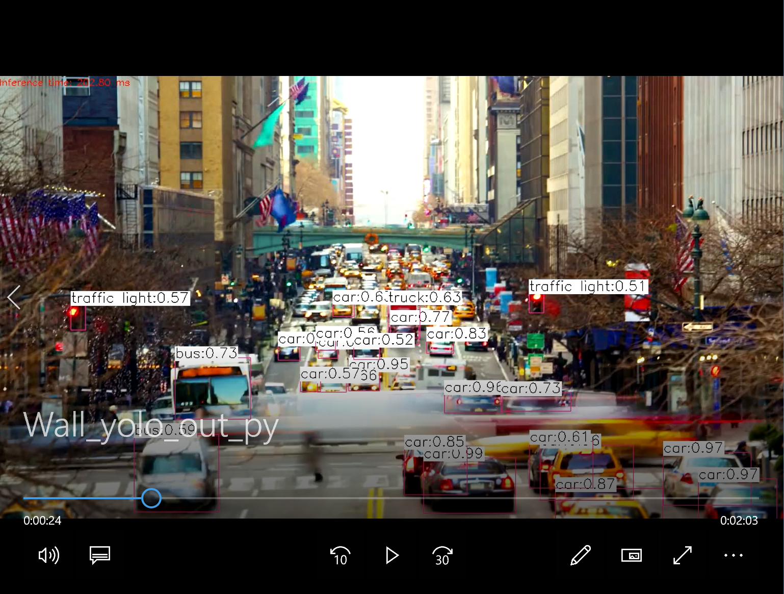
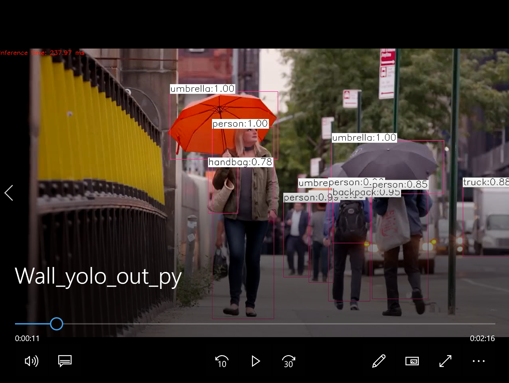

运行：

导入colab，执行main_lx.ipynb文件。

结果如下：
- **检测单个图片：**

  

- **检测视频目标：** 视频下载-->[百度云](https://pan.baidu.com/s/1o6-AuGAy2RS1I5mYStnTug)

  
  

  

- **摄像头实时检测：**
  
    直接运行命令，系统会弹出摄像头进行检测，同时会把整个录制过程保存为 yolo_out_py.avi 文件。
